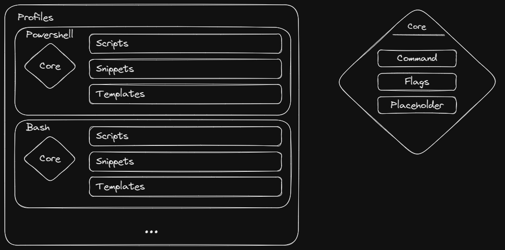

# Readme

CLI-COMPOSE is a tool to help you build and manage your own scripts, code snippets
and templates. You might have taken it from somewhere like stack overflow or from
someone's blog. This will help with keeping track of that.

## Goals

1. Add a command block
    - Select (Command) interpreter
    - Add a code block
    - Select a group for the command
    - Create a file for the command
2. Add a snippet
    - Add a group of the snippet
    - Add a name of the snippet
    - Add a simple but powerful search engine
3. Add Profile
    - A profile is a command execution program/interpreter
    - A profile can be a command and flags
